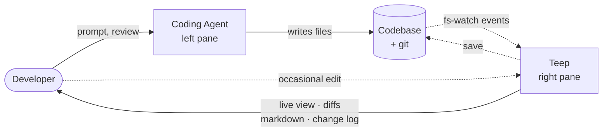

# Teep

> *Your private telepath for the agent writing your code.*

Teep sits in the pane next to your coding agent and reads the room. Every file the agent touches, every change it slips in, every edit that needs a second pair of eyes — Teep is already watching. Syntax-highlighted, git-aware, beautifully rendered Markdown, live the moment the agent writes it.

*You drive the agent. Teep watches the agent.*

A terminal viewer, not an editor. Fast to start, quiet when nothing's happening, impossible to miss when something is. Built in Rust. Ghostty-first. One binary plus the `git` you already have. Press `n` to jump to whatever the agent just did. Press `u` when you've seen enough. That's the loop.

---

## Install

**macOS (primary):**

```sh
brew install teep-app/teep/teep
```

**Linux & fallback (shell installer):**

```sh
curl -fsSL https://github.com/teep-app/teep/releases/latest/download/teep-installer.sh | sh
```

**Direct download:** [releases page](https://github.com/teep-app/teep/releases/latest) — prebuilt tarballs for macOS (arm64 / x86_64) and Linux (x86_64 / aarch64), each with a SHA256 checksum.

**Build from source (requires Rust 1.93+):**

```sh
git clone https://github.com/teep-app/teep
cd teep
cargo install --path .
```

**Optional runtime dep:** `mmdc` (mermaid-cli) for inline mermaid diagrams in Markdown. Without it, mermaid fences render as an honest placeholder with the source inside.

```sh
brew install mermaid-cli
# or: npm i -g @mermaid-js/mermaid-cli
```

**Inside tmux:** run `tmux set -g allow-passthrough on` so the terminal graphics escape sequences reach Ghostty/iTerm2.

---

## What Teep does

Teep is a persistent, always-on, auto-refreshing, git-aware file viewer designed for one specific workflow — *a human supervising a coding agent in a split pane*.



Solid arrows are the main flow: you drive the agent, the agent edits the repo. Dotted arrows are Teep's contribution: it tails the filesystem so you always know what just happened, and it lets you reach in and fix the occasional typo without context-switching out of the session.

## Features

- **Live file tree** respecting `.gitignore`, with a change log of every file the agent has touched since checkpoint.
- **Syntax-highlighted viewer** with inline `git diff` vs HEAD.
- **Worktree + branch switcher** for agents that juggle multiple worktrees.
- **Beautiful Markdown**: GFM tables, task lists, code blocks (syntect-highlighted), Obsidian-style reveal-on-cursor editing.
- **Inline images** via the Kitty graphics protocol (iTerm2, Sixel, and halfblocks fallbacks).
- **Mermaid diagrams** rendered inline via `mmdc` with a content-hash cache.
- **Small edits** for fixing the agent's typos without leaving the session — `i` to edit, `Ctrl-S` to save, `Esc` to exit.

## Keybindings

| Key | Action |
|---|---|
| `↑` `↓` | Move tree selection / scroll viewer |
| `Enter` / `o` | Open file (or toggle dir) |
| `n` / `N` | Next / prev agent-changed file |
| `u` | Checkpoint — mark all changes seen |
| `/` or `Ctrl-P` | Fuzzy file finder |
| `:` | Command palette |
| `?` | Help overlay (full keymap) |
| `d` | Toggle inline diff vs HEAD |
| `m` | Toggle Markdown Live Preview (on `.md` files) |
| `g` | Git status overlay |
| `b` | Worktree switcher |
| `i` / `e` | Enter edit mode (`Esc` exits) |
| `Ctrl-S` | Save |
| `Ctrl-B` | Toggle sidebar |
| `Ctrl-C Ctrl-C` | Quit |

## Not for you if

- You want a full editor. Use Neovim, Helix, or VS Code — Teep never competes with them.
- You don't work with AI coding agents. Teep's workflow assumes you do.
- You live inside an IDE's integrated terminal and never split panes.

## Status

Early. Under active development. v0.1 is the first public cut.

## Issues, questions, security

- **Bugs / feature requests:** open an issue on this repo.
- **Security reports:** email **teep@teep.app** directly; please don't file a public issue for security-sensitive reports.
- **General contact:** **teep@teep.app**.
- **Contributions:** see [`CONTRIBUTING.md`](./CONTRIBUTING.md) — Teep is currently maintained by one person and not accepting drive-by PRs.

## Acknowledgments

Teep was developed collaboratively with [Claude Code](https://claude.ai/code).

## License

Dual-licensed under [MIT](./LICENSE-MIT) or [Apache 2.0](./LICENSE-APACHE), at your option.
